# CardGame_21 - Portfolio Project 2

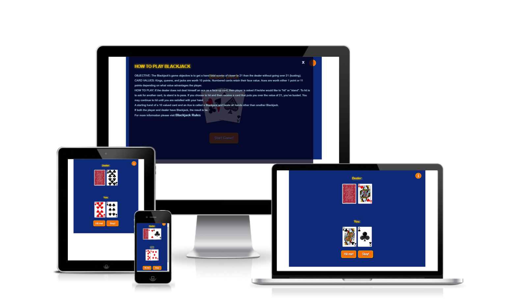 

## Live Project

[View the live website on GitHub Pages](https://larisalg.github.io/CardGame_21/)

## Table of Contents

* [Project Goals](#project-goals)
  + [User Goals](#user-goals)
  + [Site Owner Goals](#site-owner-goals)
* [User Experience (UX)](#user-experience)
   + [Target Audience](#target-audience)
   + [User Requirements and Expectations](#user-requirements-and-expectations)
* [Design](#design)
   + [Color scheme](#color-scheme)
   + [Fonts](#fonts)
   + [Structure](#structure)
* [Wireframes](#wireframes)
* [Features](#features)
* [Technologies & Tools](#technologies--tools)
   + [Languages](#languages)
   + [Frameworks & Tools](#frameworks-&-tools)
* [Fixed Bugs](#fixed-bugs)
* [Testing](#testing)
    + [Device Testing](#device-testing)
    + [Browsers Tested](#browsers-tested)
* [Validation](#validation)
   + [HTML Validation](#HTML-validation)
   + [CSS Validation](#CSS-validation)
   + [JavaScript Validation](#javascript-validation)
   + [Performance](#performance)
* [Credits](#credits)
* [Deployment](#deployment)
    + [GitHub Pages](#github-pages)
    + [Making a Local Clone](#making-a-local-clone)

## Project goals

The purpose of this project is to create a simplified version of the game based on the rules of the game 21 points or Blackjack.

### User Goals

- To play a game that is easy to use
- To play a game which allows me to improve my focus and mathematics skills
- To play a game with a responsive design so that I can easily use it on my mobile device

### Site Owners Goals

- Create a fun and easy card game
- Create a visually attractive design
- Make navigating around the website simplistic
- Build a responsive and accessible website for all users of the website

[Back to the top](#table-of-contents)

## User Experience (UX)

### Target Audience
This game can be played by anyone who loves simple math problems and wants to have some fun, test their luck and at the same time spend time usefully.

### User Requirements and Expectations

- Simple game rules
- Easy and minimalistic site navigation
- Responsive website that allows any user to play the game on different devices
- All elements such as buttons or links work properly

[Back to the top](#table-of-contents)

## Design
### Color Scheme

For the project, how the primary colors were chosen for reasons of contrast and to give some resemblance to the color scheme used in the casino.
Initially, I was going to use a black background color for this project. However, potential users commented that black was depressing and tiring on the eyes, and after some deliberation, I decided to go for navy blue, as it goes well with golden yellow and white. 

### Fonts

For this project, I chose the web safe fonts for HTML and CSS Arial and Helvetica from the sans-serif family recommended by [W3schools](https://www.w3schools.com/cssref/css_websafe_fonts.asp.).

### Structure
The structure of the website was developed to be minimalistic and easily navigated. The whole game is within a single container  in the center of the screen. 

- The game contains the following screens:

   - Landing screen with an information icon in the top right corner, game title with a cards image under it, and a button Start Game!
   - The main game screen displays once the user clicks the button Start Game!, it contains the game field with dealt cards for Dealer and User and 2  buttons which allows User to make decision and interact with the game. 
   - Once the game is finished either by losing or winning  the scores appears near each player, and a message appears above Player scores informing the user of a win, lose or tie
   -  Shortly after the message (about 3 seconds) the main game screen hides and landing screen appears again for user
   - If the user clicks the information mark, a modal window pops up showing basic Blackjack game rules and a link to Wikipedia page for more information for curious user needs more information about the game 

[Back to the top](#table-of-contents)

## Wireframes

The wireframes have been slightly alterated during the actual project creation. 
Also, since the landing screen was not originally planned, sketches for it and the pop up modal window were not made.

Desktop and large screens

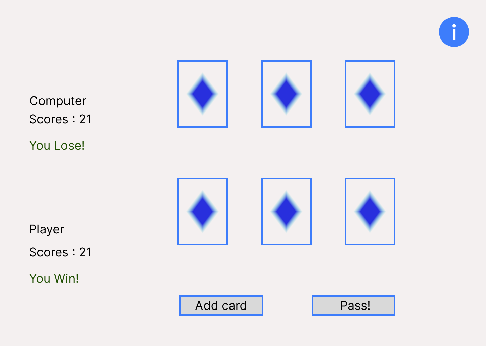

Tablet and medium screens

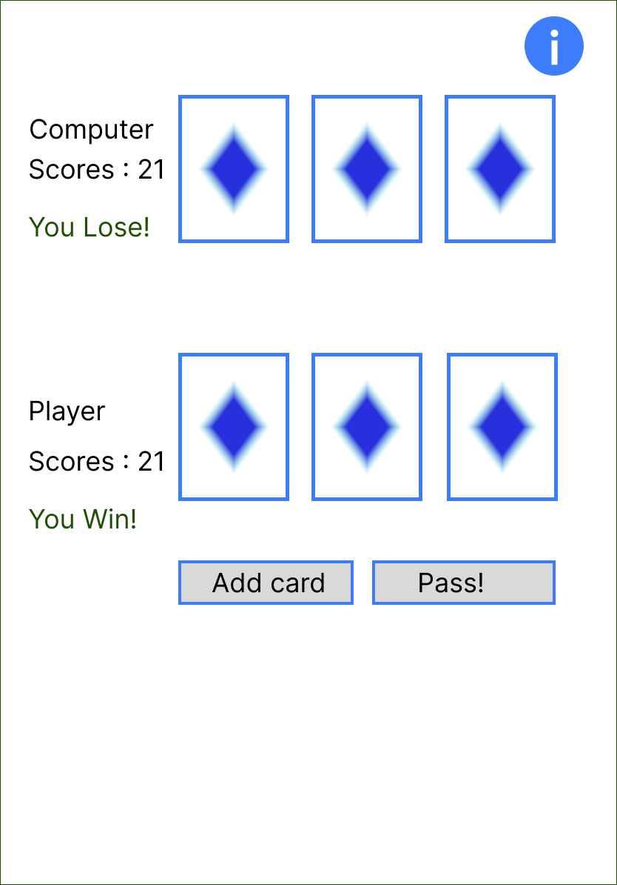

Mobile and smaller screens

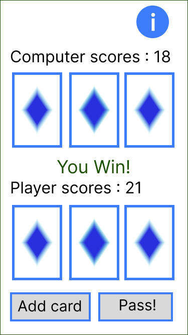

[Back to the top](#table-of-contents)
## Features

The game consists of one page. During The user during the game sees different views of the same page.

### Landing screen
The landing screen has an information button to show a modal window with the rules of the game.
The button "Start game!" hides the landing screen.

See Screenshot

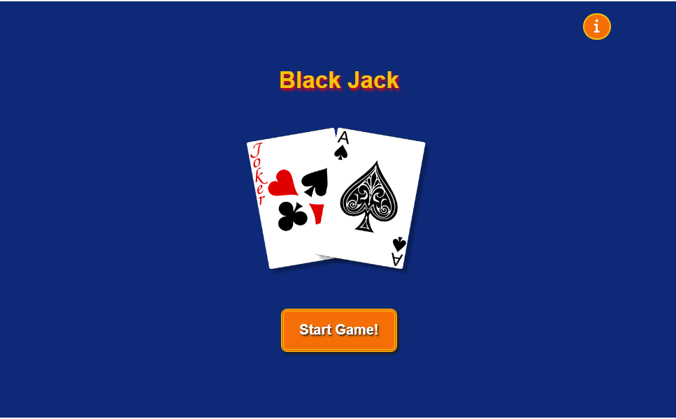

 

### Modal window
The modal window is available to the user on both screens.
The modal window itself also has a Close button.

See Screenshot

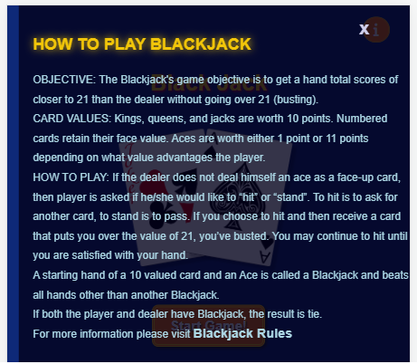

 

### Main field
The main field of the game has 2 buttons, allowing the player to make a choice if he wants to draw more cards or stay with his hands.

See Screenshot

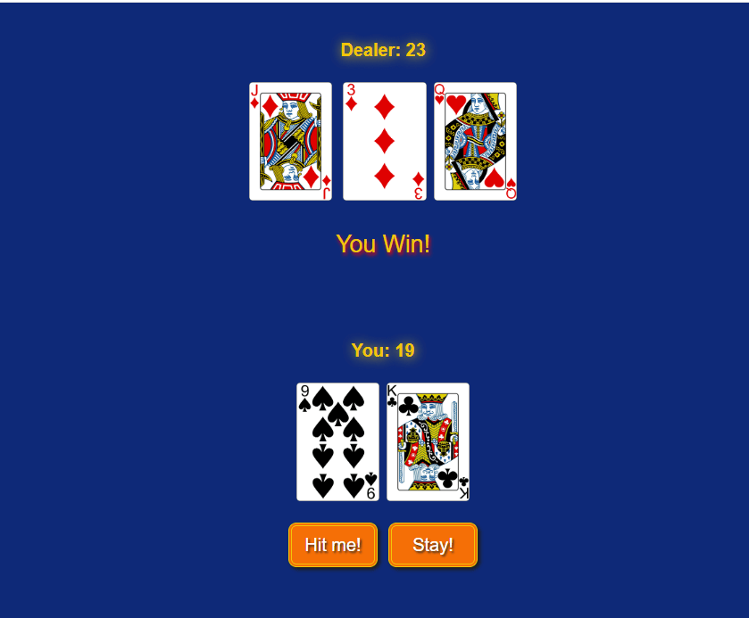

 

[Back to the top](#table-of-contents)

## Technologies & Tools

### Languages

Languages used in this project:
+ HTML5 to create project structure
+ CSS3 to style and presentation
+ JavaScript to add some functionality for project

### Frameworks & Tools

 + Figma was used to create wireframes
 + VSCode was used as IDE
 + Tinypng was used to reduce the size and weight of images and optimizing interaction with the site 
 + Gitpod was used as platform for remote development
 + Github was used for version control 
 + Font Awesome was used as icon library during project developing
+ [Chrome Developer Tools](https://developer.chrome.com/docs/devtools/) to debug any problem while working on a project with JavaScript
+ [WC3 Validator](https://validator.w3.org/) to validate HTML code
+ [Jigsaw W3 Validator](https://jigsaw.w3.org/css-validator/) to validate CSS code
+ [JShint](https://jshint.com/) to validate JavaScript code
+ [Lighthouse](https://developers.google.com/web/tools/lighthouse) used for testing performance, accessibility, best practices and SEO
+ [Am I Responsive](http://ami.responsivedesign.is/)  to generate an image showcasing the website's responsivness to different screen sizes 

[Back to the top](#table-of-contents)

## Fixed Bugs
## Bugs

|  Bug  |  Bug image            |    Fix   |
| ----- |:---------------------:| ---------|
|  When dealing cards, the face of the card  is not shown. The reason for the discrepancy  between the filenames (2-hearts.png,  3-spades.png) and the declaration of suits   in array of suits let suits = ["C", "D", "H", "S"],  where C for Clubs, D for diamonds and etc.    | 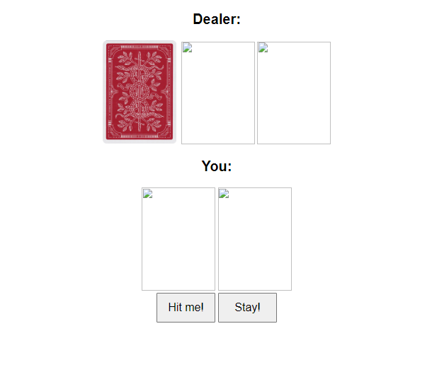 | Resolved by changing the name  of the elements of the array of suits to the more verbose C=clubs, S=spades and etc. |
| During code testing got error favicon  not found in Chrome Developer Tools Console      | 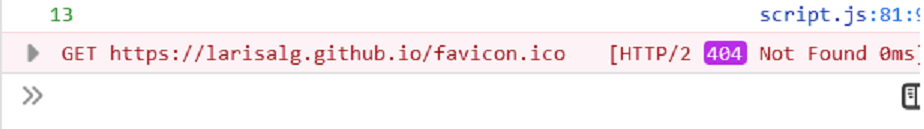      |   Create favicon and add link to the head tag|
| While testing the game in Firefox, the text  on the button is located incorrectly and in 2 lines | 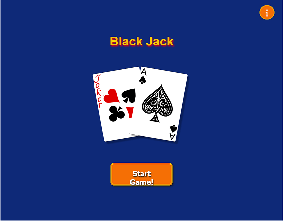      | Changed the style for the button so that the text is centered on 1 line |
| After the first round of the game after clicking  "Start game!" the landing screen remains  and the field of the previous game is displayed under it.    | 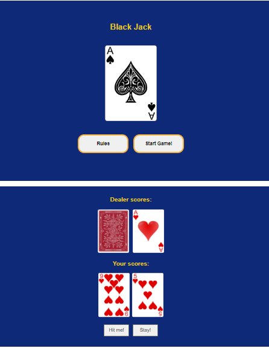      | Resolved by adding a page reload function to clear the playing field from previous results |

[Back to the top](#table-of-contents)

## Testing
### Device Testing

Project was tested using a multi-device emulator with different display sizes in the Google Chrome Developer Dashboard.
The following devices have been tested:

- Nest HubMax (Desktop)
- iPad Pro (Tablet)
- iPad Air (Tablet)
- iPad Mini (Tablet)
- Galaxy Tab S4 (Tablet)
- Nexus 7 (Mobile)
- Nokia N9 (Mobile)
- iPhone 5/SE (Mobile)
- iPhone 4 (Mobile)

### Browsers Tested

Testing has been carried out on the browsers listed below:
  - Google Chrome Version 102.0.5005.63 
  - Firefox Version101.0.1 
  - Edge Version Version 102.0.1245.39 
    
[Back to the top](#table-of-contents)

## Validation

### HTML Validation
The [W3C Markup Validation Service](https://validator.w3.org/) was used to validate the HTML of the website. The project's HTML passed validation without errors.

index.html

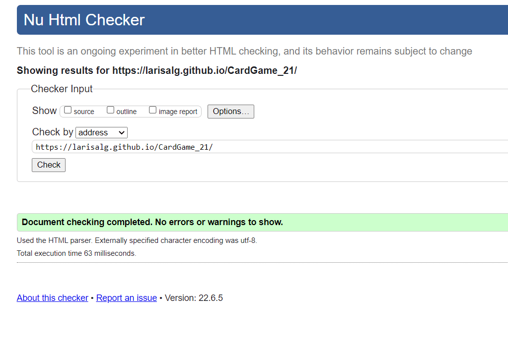

### CSS Validation

The website CSS style has successfully passed the [W3C Jigsaw CSS Validation Service](https://jigsaw.w3.org/css-validator/). 
Link to CSS validation page [here](http://jigsaw.w3.org/css-validator/validator$link).

style.css

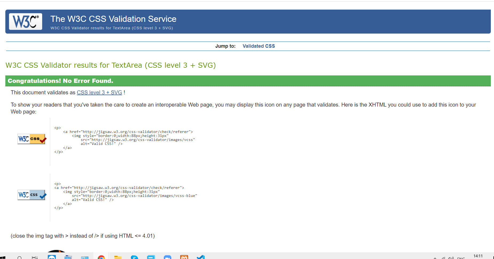

 

### JavaScript Validation

To validate the JavaScript, [JSHint](https://jshint.com/) was used. Received a warning about an unused variable that was removed. There were no error messages after re-checking.

### Performance

To test the performance and availability of the deployed site, a Lighthouse report was generated using Google Chrome Dev Tools for desktop version and mobile version.

Desktop version

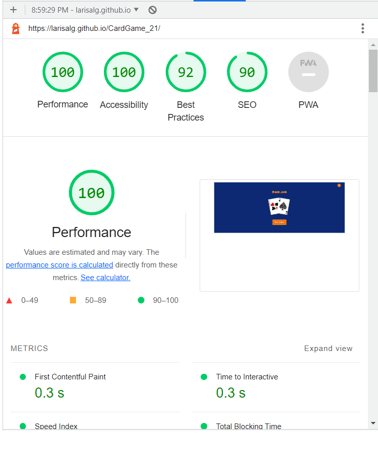

Mobile version

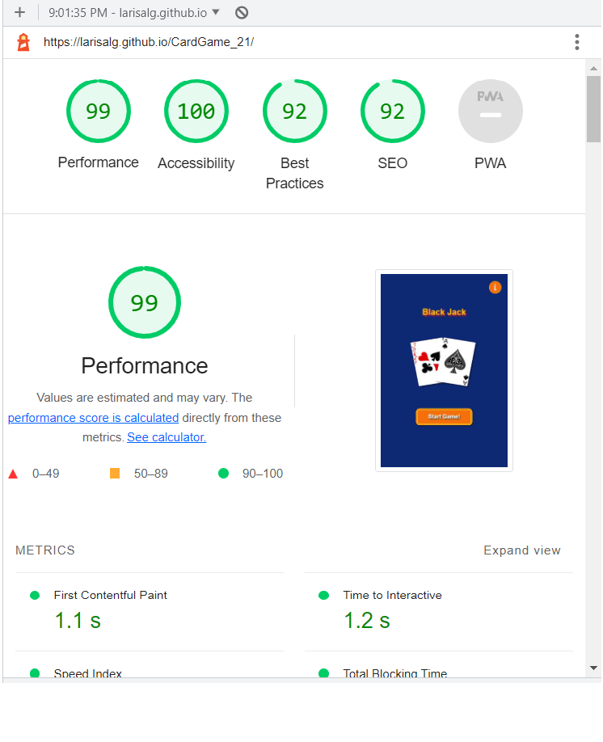

[Back to top](#table-of-contents)

